# 🤖 Autonomous AI Bug-Fixing Agent

An advanced, autonomous AI agent that analyzes, plans, and automatically fixes bugs in software repositories. This project leverages a powerful multi-LLM architecture with **Cohere's `command-r`** for strategic planning, **Google's `gemini-pro`** for high-speed quality assurance, and a **Neo4j Knowledge Graph** for deep codebase analysis.

## ✨ Key Features

-   **⚙️ Autonomous Operation**: Takes a GitHub repository URL and a bug description as input and works end-to-end to produce a fix.
-   **🧠 Knowledge Graph Analysis**: Builds a Neo4j knowledge graph of the codebase to understand file structures, class definitions, and function relationships before acting.
-   **🤝 Multi-LLM Synergy**:
    -   **Planner (`command-r`)**: Cohere's state-of-the-art model generates precise, multi-step tool-use plans to address the issue.
    -   **Reviewer (`gemini-pro`)**: Google's lightning-fast model performs strict, logical quality assurance on the executed plan to verify its success.
-   **🔄 Self-Correcting Loop**: If the Gemini reviewer finds a flaw, the workflow automatically loops back to the Cohere planner with detailed failure context, enabling a more informed and effective second attempt.
-   **📚 Knowledge Persistence**: Successful bug-fix plans are saved back into the Neo4j graph, allowing the agent to learn from past successes and solve similar problems more efficiently.
-   **🚀 Automated Git Integration**: Upon a successful and verified fix, the agent automatically commits the changes and pushes them back to the source repository.

## 📊 Workflow Diagram

The agent operates in three distinct phases, from initial setup to the core bug-fixing loop and final deployment.

```mermaid
graph TD
    %% --- Style & Configuration Definitions (Global Scope) ---
    classDef startEnd fill:#8BC34A,color:#fff,stroke:#689F38,stroke-width:2px,rx:20,ry:20;
    classDef processNode fill:#2196F3,color:#fff,stroke:#1976D2,stroke-width:2px,rx:5,ry:5;
    classDef decisionNode fill:#FFC107,color:#000,stroke:#FFA000,stroke-width:2px,shape:diamond;
    classDef externalNode fill:#333,color:#fff,stroke:#000,stroke-width:2px,rx:5,ry:5;
    classDef dbNode fill:#673AB7,color:#fff,stroke:#512DA8,stroke-width:2px,shape:cylinder;
    classDef aiNode fill:#E91E63,color:#fff,stroke:#C2185B,stroke-width:2px,rx:5,ry:5;

    %% --- Main Workflow Structure ---

    subgraph "Phase 1: Setup & Analysis"
        direction LR
        UserInput["👩‍💻 User Input<br>Repo URL & Issue Description"]:::processNode
        CloneRepo["Clone Repository<br>Input from GitHub"]:::externalNode
        BuildKG["Build Knowledge Graph<br>Parse code into Neo4j"]:::dbNode
        
        UserInput --> CloneRepo --> BuildKG
    end

    subgraph "Phase 2: Core Bug-Fixing Loop"
        Planner["📝 Planner (command-r)<br>Generate step-by-step plan"]:::aiNode
        Executor["⚙️ Executor<br>Run tools (read/write files)"]:::processNode
        Reviewer{"🕵️‍♀️ Reviewer (gemini-pro)<br>Is the plan successful?"}:::decisionNode
        
        Planner --> Executor
        Executor --> Reviewer
        Reviewer -. "Revise (Failure) ❌" .-> Planner
    end

    subgraph "Phase 3: Deployment & Cleanup"
        direction LR
        SavePlan["💾 Save Successful Plan<br>Update Knowledge Graph"]:::dbNode
        PushToGitHub["Commit & Push Fix<br>Output to GitHub"]:::externalNode
        Cleanup["🗑️ Cleanup<br>Delete local temp repo"]:::processNode
        End([END]):::startEnd
        
        SavePlan --> PushToGitHub --> Cleanup --> End
    end

    %% --- Connecting the Phases ---
    BuildKG --> Planner
    Reviewer -- "Continue (Success) ✅" --> SavePlan

    %% --- Clickable Link for the GitHub Output Node ---
    click PushToGitHub "https://github.com" "View on GitHub" _blank
```



## 🛠️ Technology Stack

-   **AI & LLMs**:
    -   **Planner**: Cohere `command-r`
    -   **Reviewer**: Google `gemini-pro`
    -   **Framework**: LangChain & LangGraph
-   **Graph Database**: Neo4j
-   **Core Language**: Python 3.8+

## 📋 Prerequisites

-   Python 3.8 or higher
-   Git installed on your system
-   Access to a running Neo4j instance (local Docker container or a free [AuraDB](https://neo4j.com/cloud/platform/aura-database/) instance).

## 🚀 Setup & Installation

1.  **Clone the repository:**
    ```sh
    git clone <your-repository-url>
    cd <repository-directory>
    ```

2.  **Install Python dependencies:**
    ```sh
    pip install -r requirements.txt
    ```

3.  **Configure Environment Variables:**
    Create a file named `.env` in the root of the project by copying the example file:
    ```sh
    cp .env.example .env
    ```
    Now, edit the `.env` file and add your API keys and database credentials:
    ```env
    # .env
    GOOGLE_API_KEY="your_google_api_key"
    COHERE_API_KEY="your_cohere_api_key"
    NEO4J_URI="bolt://your-neo4j-host:7687"
    NEO4J_USERNAME="neo4j"
    NEO4J_PASSWORD="your_neo4j_password"
    ```

## ▶️ How to Run

The agent is executed via the command line. You must provide the URL of the target GitHub repository and a clear description of the bug to be fixed.

**Command Syntax:**
```sh
python bug_fixing_agent.py --repo_url <URL_OF_GITHUB_REPO> --issue "<BUG_DESCRIPTION>"
```

**Example:**
```sh
python bug_fixing_agent.py \
    --repo_url "https://github.com/example/buggy-app" \
    --issue "The login button on the main page is not working when clicked. It should redirect the user to the dashboard."
```

### Command-Line Arguments

-   `--repo_url` (required): The full URL of the GitHub repository the agent will work on.
-   `--issue` (required): A descriptive string explaining the bug or the task to be completed.
-   `--clean` (optional): Use this flag to force a clean run. It will delete any existing local repository clone and clear the Neo4j database before starting.

## 📁 Project Structure

```
BUG-FIXER-AGENT/
├── .vscode/
├── agent_state.py
├── bug_fix_workflow.py
├── bug_fixing_agent.py
├── code_base_kg.py
├── config.py
├── file_system_tools.py
├── graph_tools.py
├── .env.example
└── requirements.txt
```
